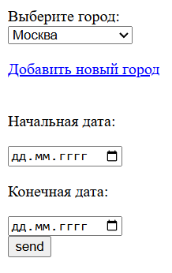
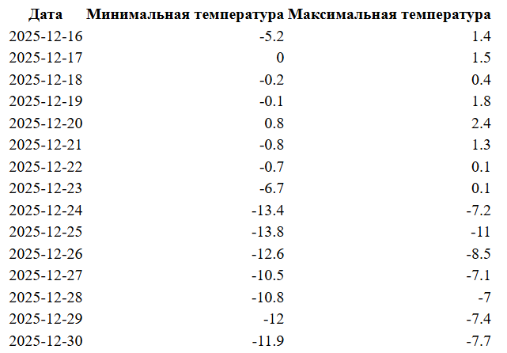
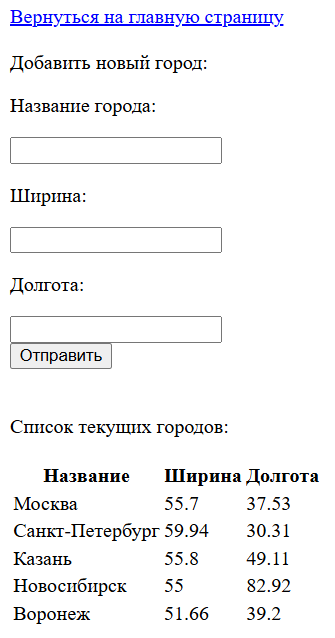

## Главное
Данное веб-приложение позволяет узнать погоду в любой точке земли, в том числе и прогноз погоды на ближайшие 2 недели

## Интерфейс
Интерфейс главной страницы приложения выглядит следующим образом

Пользователь может выбрать город, в которой ему хочется узнать погоду, а также начальную и конечную даты, которые его интересуют.

Результатом отправки формы будет таблица следующего вида

В таблице указаны минимальная и максимальная температуры за определённый день.

Помимо этого, пользователь может добавить любой город, который захочет. Говоря точнее, он может добавить любую точку Земли, указав её ширину и долготу, и дать ей название. А затем по этому названию он сможет узнавать погоду. Интерфейс добавления города выглядит следующим образом

